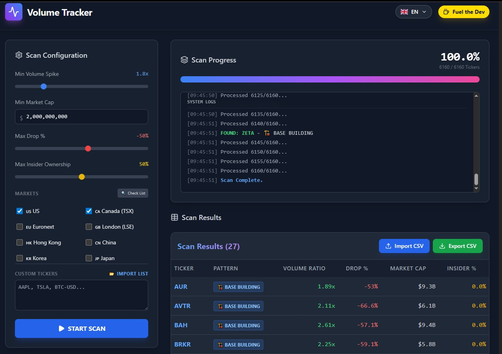
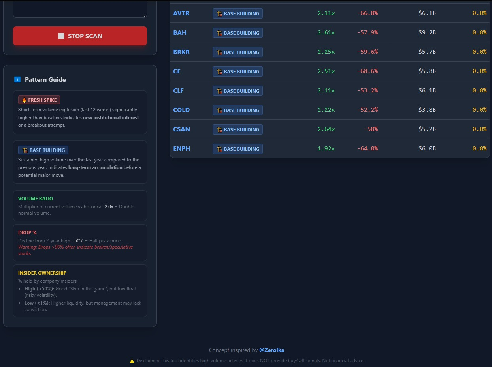

# Volume Tracker Pro 🚀

Volume Tracker Pro is a powerful, high-performance stock scanner designed to identify institutional accumulation and massive volume anomalies across global markets.

## 🌟 Key Features

- **High-Performance Scanning**: Multi-threaded scanner engine that processes thousands of tickers in minutes.
- **Global Market Support**: Scan US (NYSE/NASDAQ), Canada (TSX), Euronext, London (LSE), Hong Kong (HKEX), China (SSE/SZSE), Korea (KRX), and Japan (JPX).
- **Advanced Volume Detection**:
  - 🔥 **FRESH SPIKE**: Detects short-term volume explosions (last 12 weeks) indicating new institutional interest.
  - 🏗️ **BASE BUILDING**: Identifies long-term accumulation patterns where volume is sustained at high levels.
- **Deep Filters**: Filter by Market Cap (USD converted), max Insider Ownership %, and Price Drop % from 2-year highs.
- **Multilingual UI**: Full support for English, French, Spanish, Italian, Chinese, and Thai.
- **Data Management**:
  - Export results to CSV for external analysis.
  - Import previous CSV results to quickly resume your research.
  - Import custom ticker lists (TXT/CSV) for targeted scans.

## 🛠️ Prerequisites

- **Python 3.9+**
- **Node.js 14+**
- **npm** (comes with Node.js)

## 🚀 How to Run

1. **Download the project** or clone the repository.
2. **Run `run_app.bat`**: 
   - This script will automatically install all Python dependencies (`requirements.txt`).
   - It will launch the FastAPI Backend and the Vite/React Frontend.
   - It handles port cleanup to ensure a smooth startup.
3. **The app will open automatically** in your default browser at `http://localhost:5173`.

## ℹ️ Disclaimer

**This tool is for educational and research purposes only.** It identifies volume activity based on technical criteria and does NOT provide buy/sell signals. Trading involves significant risk. Always perform your own due diligence. **Not financial advice.**

## ❤️ Support the Developer

If you find this tool helpful and want to support its continued development, you can help by:

- **Buying me a coffee**: [buymeacoffee.com/goldenlog](https://buymeacoffee.com/goldenlog)
- **Supporting on Ko-fi**: [ko-fi.com/goldenlog](https://ko-fi.com/goldenlog)

### 💎 Crypto Donations
- **Bitcoin (BTC)**: `bc1q7hynfjgws6kyax0uq2faayhvf64f7avs5v854t`
- **Ethereum (ETH)**: `0xe4BcDe9cA927e3f8A6F26fE4e16B67C76fecdF14`
- **Solana (SOL)**: `GoXhF56h1hwHDE7LiRdCikFpoMzHuhXMNQcByHKxkKYP`

---
*Concept inspired by [@ZeroIka](https://x.com/IamZeroIka)*
